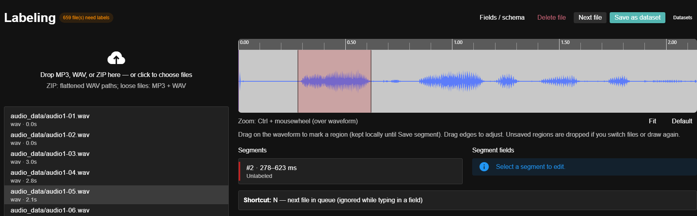
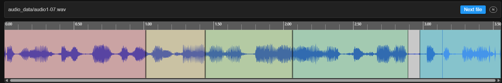
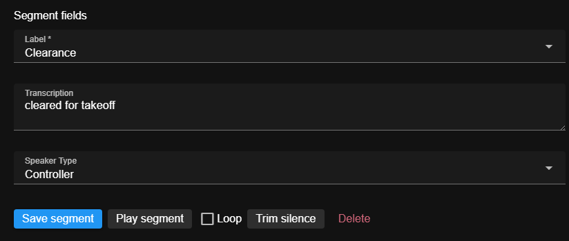
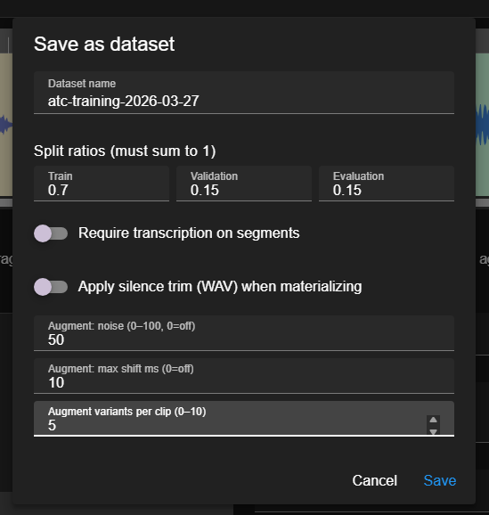
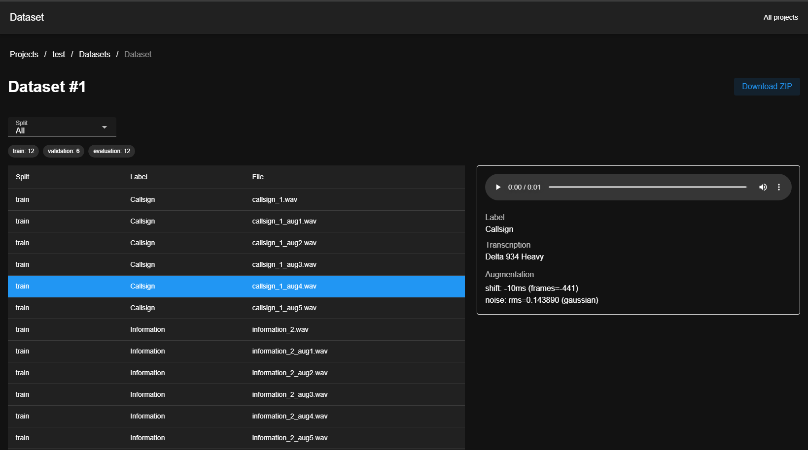

# Audio ML Toolkit

For now, this is a small UI aimed at creating datasets and speeding up labeling: projects and collections, waveform segments, a per-collection schema for fields, and exports (splits, augmentation, and related options) you can feed into other tools.

The direction is to make the project more useful for training and evaluation workflows, especially classification and automatic speech recognition (ASR), and over time to offer more than a browser UI (for example CLIs, integrations, or helpers that sit next to training pipelines). None of that is promised on a schedule; what exists today is the labeling and dataset-export stack below.

Full documentation (setup, UI tour, env vars): [https://birdhalfbaked.github.io/aml-toolkit/](https://birdhalfbaked.github.io/aml-toolkit/)

## Features

- Projects and collections - Top-level projects contain collections (folders of audio). Open a collection to label every file inside it.
- Uploads - Drag-and-drop MP3/WAV or ZIP. ZIP contents are flattened: nested paths are turned into filename prefixes (no directory tree in storage).
- Configurable schema - Per collection, define segment-scoped and file-scoped fields (taxonomy, text, etc.). Required fields drive a labeling queue so you can see what still needs work.
- Waveform labeling - Interactive waveform with regions. New regions stay draft in the browser until you save the segment; switching files or drawing again discards an unsaved draft.
- Label focus mode - Optional full-width layout that hides the file list; Next file and the N shortcut advance through the queue.
- Datasets - Save as dataset from labeling to build an export with options for splits, augmentation, and more. Browse builds under Datasets and open a detail view for status and paths.
- Persistence - SQLite database and on-disk audio/layout under configurable paths (see the docs for `AUDIO_TAGGER_DATA`, `AUDIO_TAGGER_DB`, and related env vars).

## Tech stack

| Layer    | Details |
| -------- | ------- |
| Frontend | Vue 3, Vuetify, Vite; Yarn for installs (`yarn` / `yarn dev`) |
| Backend  | Go, [julienschmidt/httprouter](https://github.com/julienschmidt/httprouter), REST API under `/api` |
| Data     | SQLite (modernc.org driver); migrations via `go run ./cmd/migrate` (desktop applies them on startup) |

## Desktop (Wails)

**Developer mode:** Install [Wails v2](https://wails.io/docs/gettingstarted/installation) (Go-based CLI: `go install github.com/wailsapp/wails/v2/cmd/wails@latest`, then ensure `$(go env GOPATH)/bin` is on your `PATH`). From `backend/cmd/wails`, `wails dev` runs the desktop shell with Vite HMR; `wails build` produces a release binary under `build/bin/`. Node, Yarn, and platform extras still apply (WebView2 on Windows, Xcode CLT on macOS, GTK/WebKit packages on Linux—see the Wails install guide).

**Release UI:** `wails build` runs `yarn build`, which copies `frontend/dist` into `backend/cmd/wails/dist` for `//go:embed` in the Wails command package. The binary is built with `-tags embedui` ([`wails.json`](backend/cmd/wails/wails.json) `build:tags`). At runtime, [Wails serves GETs from `AssetServer.Assets`](https://wails.io/docs/reference/options#assetserver) first; anything not in the embed (including client routes) falls through to the same `http.Handler` as the API for SPA fallback. To prefer disk assets over the embed, set **`AUDIO_TAGGER_FRONTEND_DIR`** to an absolute path to a `dist` folder that contains `index.html`.

**Prebuilt binaries:** GitHub Actions builds the desktop app for **Windows 64-bit (10/11)**, **macOS** (universal Intel + Apple Silicon), and **Linux** (amd64 and arm64) on pushes to `main`, pushes of version tags (`v*`), pull requests, and manual workflow runs (not only when you publish a GitHub Release). Open the [Desktop build workflow](https://github.com/birdhalfbaked/aml-toolkit/actions/workflows/desktop-build.yml), pick the latest run, and download the artifact for your platform (each artifact is a zip of `build/bin` contents: `.exe`, `.app` bundle, or Linux binary). Linux arm64 jobs use GitHub’s `ubuntu-24.04-arm` runner, which requires a **public** repository on the free tier; if that job is unavailable in your fork, build locally with `wails build -platform linux/arm64` on an arm64 machine.

Optional native shell: the same Vue UI and REST API are served inside a Wails window. Wails forwards document and `/api` traffic to the same `http.Handler` stack as `go run .` (via [assetserver.Options.Handler](https://wails.io/docs/reference/options#assetserver)). Segment preview uses **system audio** through Go ([gopxl/beep](https://github.com/gopxl/beep)) while WaveSurfer stays muted and follows `desktop:audio:position` events.

**Desktop vs browser API traffic:** In the Wails window, `window.go.main.App` is present, so the frontend routes JSON and binary downloads through **`ApiDispatch`** (in-process `httptest` into that same handler) instead of `fetch`. The Wails binary does **not** open an extra TCP port for `/api` during `wails dev`. **Waveform decode** uses **`DesktopReadAudioFileForWaveform`** (bytes read in Go, then a `blob:` URL in the UI). **Dataset sample preview** loads audio through **`ApiDispatch`** as a blob as well, so the desktop window does not rely on `GET /api/...` from the Vite origin.

If you open a **normal browser tab** at `http://localhost:5173/` while Vite is running (for example during `wails dev` or `yarn dev`), `/api` requests are proxied by [`frontend/vite.config.ts`](frontend/vite.config.ts) to `http://127.0.0.1:8080`. Run the standalone API in another terminal: `cd backend && go run .` (default `:8080`, see [`ListenAddr`](backend/internal/httpserver/httpserver.go)). Align `AUDIO_TAGGER_DB` / `AUDIO_TAGGER_LIBRARY` with the desktop app if you need the same data in both. You can also set **`VITE_API_BASE`** when building or in `.env` if the API is hosted elsewhere.

**File imports (ZIP / audio) on desktop:** The labeling UI does not rely on in-WebView `FormData` uploads. Wails is configured with **OS file drop** (`EnableFileDrop`, `DisableWebViewDrop`) and the drop zone uses **absolute paths** passed to Go (`DesktopImportFromPaths` / `DesktopPickAndImportFiles`), which read and extract ZIPs and copy audio the same way as the HTTP handler. In a normal browser with `go run .`, drag-and-drop and file input still use `/api/.../upload`. WebView2 multipart to that route can be unreliable ([upstream discussion](https://github.com/wailsapp/wails/issues/3037)).

Prerequisites: [Wails v2](https://wails.io/docs/gettingstarted/installation), Node/Yarn, WebView2 on Windows.

```bash
cd frontend && yarn && yarn build          # production UI (or rely on wails build below)
cd backend/cmd/wails && wails build        # output: build/bin/<name>.exe (Windows)
```

Live development with HMR (Vite) and Go reload:

```bash
cd backend/cmd/wails && wails dev
```

This runs the Vite dev server (see `frontend:dev:serverUrl` in [backend/cmd/wails/wails.json](backend/cmd/wails/wails.json)) and opens the desktop window. Labeling and `/api` calls from **inside that window** use Wails bindings (`ApiDispatch`, native import, desktop waveform bytes, dataset audio blobs), so you do not need `go run .` for the desktop shell itself.

To use a **system browser** against `http://localhost:5173/` at the same time (or to `curl` `http://127.0.0.1:8080/api/...`), run `go run .` in `backend` so the Vite proxy has a target, as in [Quick start](#quick-start) below.

**Desktop storage (split from the browser server):**

- **SQLite** lives under your OS user config area, e.g. `%AppData%\\audio-tagger\\db\\app.db` on Windows (via `os.UserConfigDir()` / `audio-tagger/db/`). The app sets `AUDIO_TAGGER_DB` on startup so `go run ./cmd/migrate` can target the same file if you pass no `-db` flag after exporting that env, or pass `-db` explicitly.
- **Library root** (folders `projects/`, imported audio, etc.) is **not** the same as the DB path. On first launch the welcome screen asks you to confirm or change the folder (default: `Documents/Audio Tagger Library`). That choice is saved in `%AppData%\\audio-tagger\\config.json`. Override with env **`AUDIO_TAGGER_LIBRARY`** (absolute path) if needed.
- **Upgrades:** If you previously used `%AppData%\\audio-tagger\\data\\` for both DB and files, that layout is detected and kept automatically so existing projects keep working.

After changing Go methods bound to the UI, regenerate TS bindings (also run automatically by `wails build` / `wails dev`):

```bash
cd backend/cmd/wails && wails generate module
```

## Screenshots

<p align="center">
  
  <br /><sub>Labeling: waveform, segments, and field editor in one layout.</sub>
</p>

<p align="center">
  
  <br /><sub>Waveform: draw and resize regions; drafts stay local until you save.</sub>
</p>

<p align="center">
  
  <br /><sub>Segment fields: schema-driven labels and text, save, play, trim.</sub>
</p>

<p align="center">
  
  <br /><sub>Dataset export: splits, augmentation, and other generation options.</sub>
</p>

<p align="center">
  
  <br /><sub>Dataset detail: status, paths, and metadata for a finished build.</sub>
</p>

## Quick start

Detailed steps (prerequisites, ports, troubleshooting) are on the doc site: [Get started](https://birdhalfbaked.github.io/aml-toolkit/#get-started).

```bash
cd backend && go run ./cmd/migrate   # once per clone / after schema changes
cd backend && go run .               # API on :8080 by default
cd frontend && yarn && yarn dev       # UI on :5173, proxies /api to the API
```

Then open [http://localhost:5173/](http://localhost:5173/), create a project, add a collection, upload audio, and open the collection for labeling.

## Database migrations

The API does not apply migrations on startup. After pulling changes that touch the schema, run:

```bash
cd backend && go run ./cmd/migrate
```

Uses the same `AUDIO_TAGGER_DATA` and `AUDIO_TAGGER_DB` environment variables as the server, or pass an explicit file:

```bash
go run ./cmd/migrate -db /path/to/app.db
```

## Looking ahead

- ML workflows - Stronger support for classification and ASR training/eval, and non-UI surfaces where they help, as the design becomes clear.
- Distribution - The browser workflow remains clone + Go + Yarn + two processes; the **desktop** app also has **CI-built artifacts** (see above). Installers, signed/notarized macOS builds, and containers are still possible follow-ups if there is demand.
- Product polish - Ongoing improvements to labeling UX, exports, and schema tooling as feedback and time allow.
